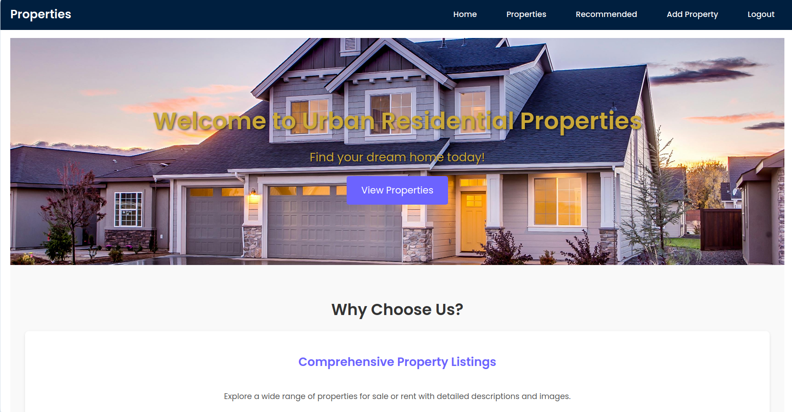
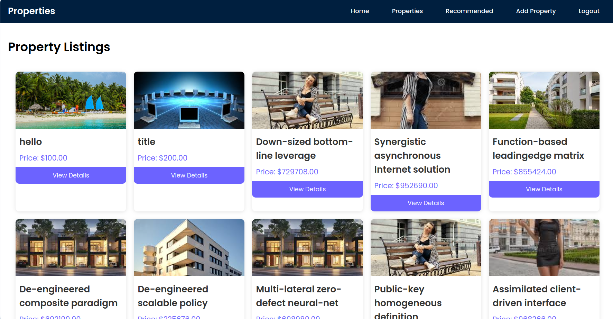
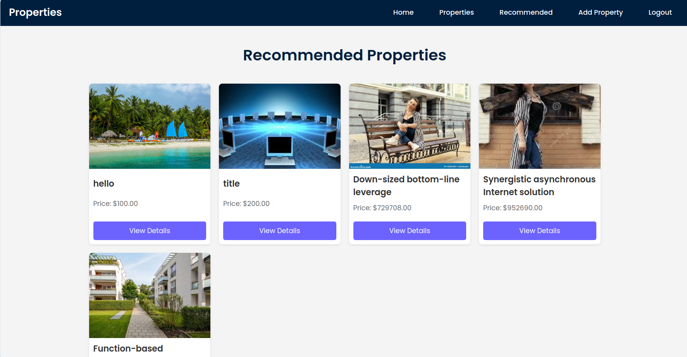
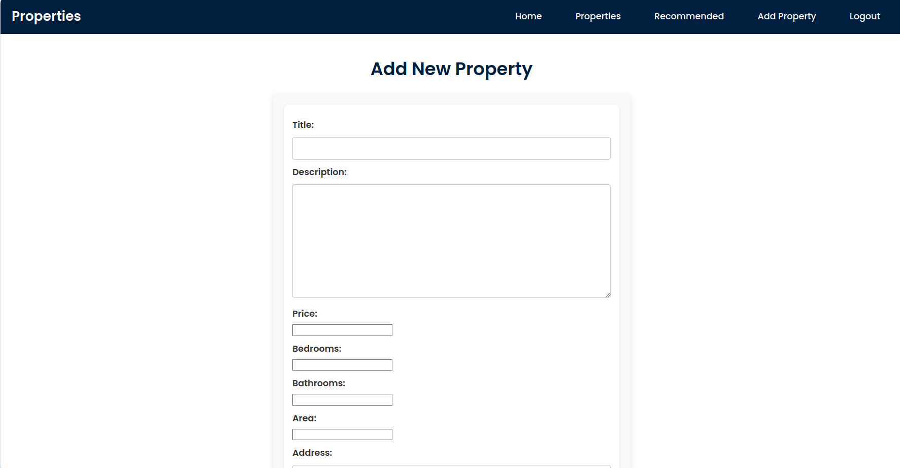
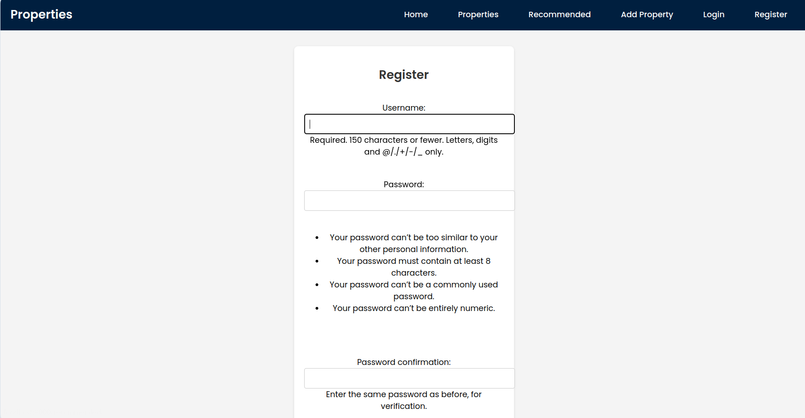
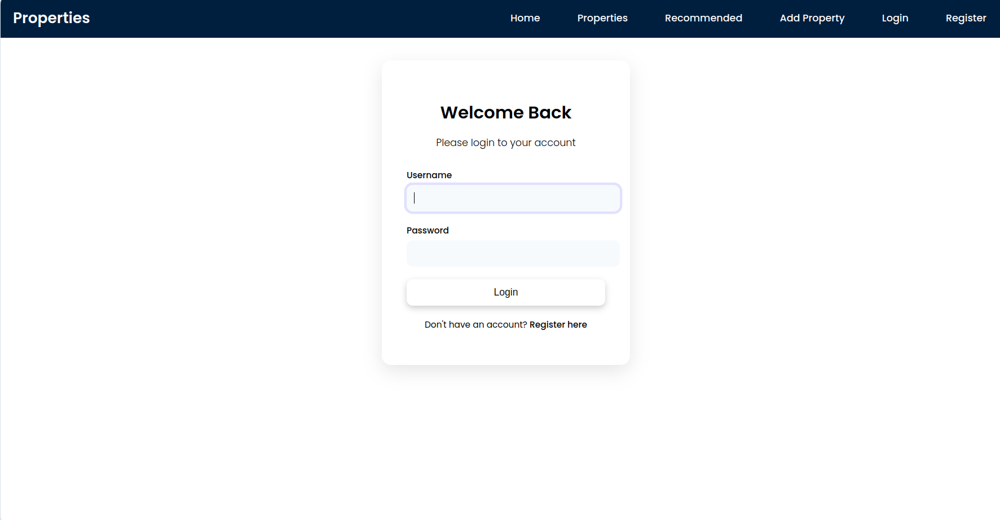

# Real Estate Project

## This is a Django-based real estate application that allows users to manage properties.

## Installation and Setup

```bash
# Step 1: Install Django
pip install django
```

# Step 2: Create a virtual environment
```bash
python3 -m venv venv
```
# Step 3: Activate the virtual environment
```bash
source venv/bin/activate  # On macOS/Linux
# venv\Scripts\activate  # For Windows
```
# Step 4: Install Django in the virtual environment
```bash
pip install django
```
# Step 5: Create a new Django project named 'realestate'
```bash
django-admin startproject realestate
```
# Step 6: Navigate into the project directory
```bash
cd realestate
```
# Step 7: Create a new Django app named 'properties'
```bash
python3 manage.py startapp properties
```
# Step 8: Make migrations to set up the database
```bash
python manage.py makemigrations
```
# Step 9: Migrate the database
```bash
python manage.py migrate
```
# Step 10: Run the development server
```bash
python manage.py runserver
# By default, this will run the server at http://127.0.0.1:8000/
```
```bash
# Run the script to generate dummy data
python generate_dummy_data.py
```

# Technology Stack

- **Backend Framework:** Django
- **Frontend Framework:** HTML, CSS, JavaScript
- **Database:** SQLite 
- **Environment:** Python Virtual Environment
- **Deployment:** Django Development Server
- **Version Control:** Git
- **Package Management:** pip


## Screenshots

### Home Page



### Properties Page


### Recommended Properties Page


### Add Property Page


### Registration Page


### Login Page

